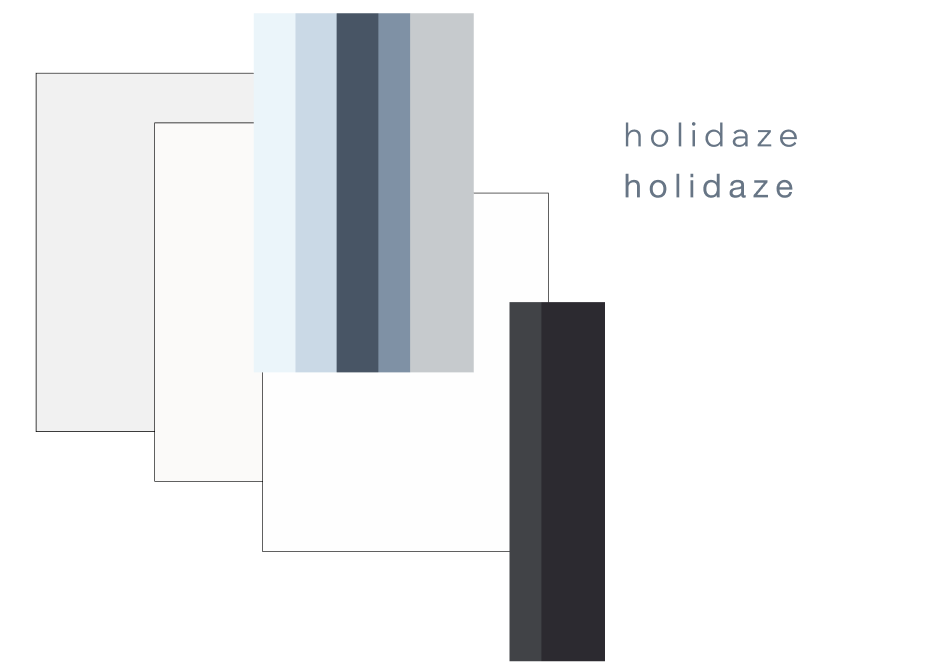
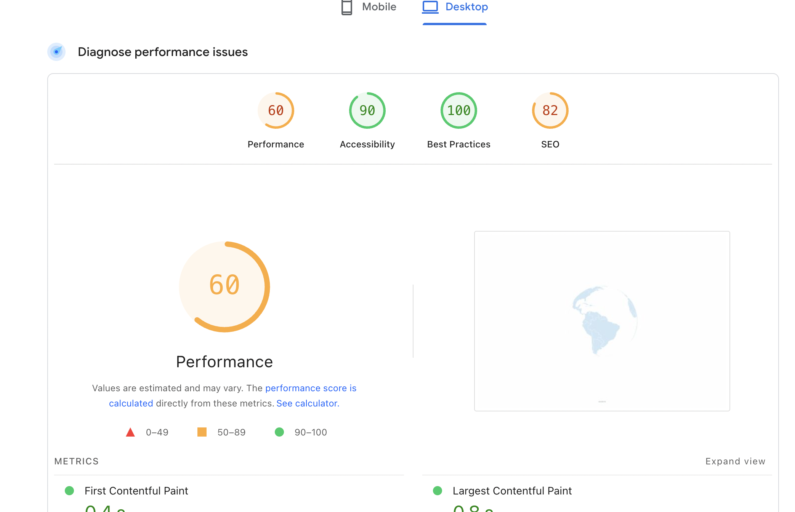
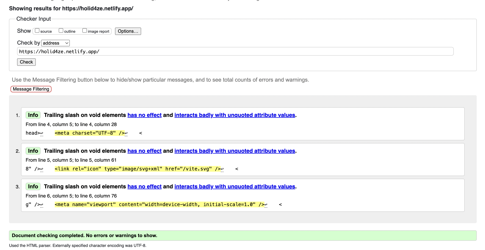

<h1>Holidaze</h1>

  

Holidaze is more than just a holiday venue booking platform, it is a conceptual exploration of how digital services can evolve alongside the users they serve.  
Holidaze envisions a near future where users are not passive consumers, but informed, sovereign participants in the digital experience.  
Rather than persuasive UX patterns or conversion-driven interfaces, Holidaze emphasizes clarity, autonomy, and radical transparency. Its brutalist minimalism reflects Web3 principles, prioritizing structure and user sovereignty over decoration and funneling.  

  <strong>
    While building for Holidaze, synchronously an hypothesis was articulated; 
    The future of the web doesn’t infantilize users, but empowers them.
  </strong>

Built with React, Tailwind CSS, and a purposeful design, this project is not only a technical implementation of a booking platform, but a space where the experience of rest begins. By clearing the clutter, canceling the noise, and offering space instead of pressure, Holidaze signals to the user that time off has already started.  

*It is a transition portal; from noise to clarity, from routine to restoration, from overstimulation back to self.*

---

## Features

### Globe Landing Page  
* Slowly rotating 3D globe (built with react-globe.gl and three.js)  
* Country click redirects to filtered venue listings  
* Minimal hover-based tooltips  
* "Explore" link navigates directly to all venues

---

### All Venues Page  
* Responsive masonry grid layout with dynamic scaling on scroll  
* Venue filtering by country, features, price, and guest count  
* Glassmorphic modal for filters  
* Lazy loading and infinite scroll  
* Search and continent/country-based discovery

---

### Venue Details Page  
* Route: /venues/:id  
* Hero images with optional carousel  
* Venue data, amenities, and location  
* Calendar-based booking form with error handling  
* Local review system stores user-submitted reviews in localStorage per venue, allowing reviews to be added and retrieved dynamically without backend persistence  
* Breadcrumb navigation

---

### Login / Register  
* Toggle between login register  
* Guest browsing  
* Email format validation for stud.noroff.no  
* Protected routes via localStorage token validation

---

### Customer Profile  
* View and update avatar and bio  
* List of upcoming bookings (with edit, cancel, rebook, review)  
* View - edit - delete buttons for full user control  
* Edit - delete buttons disappears after date of booking, review button w review logic  
* Modal system for booking actions  
* Log out

---

### Manager Profile  
* Add, view, edit, or delete venue listings  
* View stats  
* Search venues  
* Modals for listing creation and updates

---

## Design & Philosophy  
Rooted in Web3 design principles, based on the belief that:  
* Users are increasingly decentralized, data-literate, and choice-oriented.  
* Trust is built through access to clear, truthful information, not manipulation or urgency.  
* Interfaces should not lead or convert, but instead offer structure and clarity for intentional action.

To reflect this, Holidaze deliberately rejects traditional Web2 UI patterns, including:  
* Rounded corners  
* Drop shadows  
* Visual hierarchies that guide behavior  
* Repetitive or urgent call-to-action buttons

Instead, the platform introduces:  
* A paper-like, Kindle-inspired interface  
* Flat information structures  
* Minimalistic glassmorphic overlays for interactions  
* Subtle motion and transparency  
* Typographic hierarchy stripped of urgency

This interface assumes a confident, digitally mature user, one who does not require persuasion, but simple clarity and autonomy.  
Holidaze uses all-lowercase typography throughout the platform, with minimal contrast in size or weight. This decision breaks from convention and rejects traditional visual hierarchy. At first I was worried it would affect accessibility, however the testing luckily proved otherwise. The desicison of using all lower-caps aligns with the broader design philosophy: to create an ambient, unintrusive interface that treats all information with equal visual weight. The absence of visual urgency reflects trust in the user’s ability to navigate without noise.  
This is not a “conversion-first” interface, but it is an interface of quiet presence and calmness.

  

---

## Accessibility & Intentional Trade-offs  
While Holidaze adheres to many WCAG and Lighthouse standards, some accessibility conventions have been deliberately softened in favor of minimalist UX principles.

| Element             | Rationale                                         |
|---------------------|---------------------------------------------------|
| Low visual hierarchy | Designed to foster user autonomy                  |
| Sparse CTAs         | Avoids urgency or funneling behavior              |
| Flat color palette  | Minimizes visual noise and overstimulation        |

Accessibility is still respected through  
* Valid semantic HTML  
* Keyboard navigability  
* Proper color contrast and spacing  
* WCAG validation  
* Manual testing via Lighthouse, WAVE, and real user sessions
  
--- 

## Testing & QA  
- **Manual User Story Testing:** All key user flows were manually tested and verified, including booking, profile interactions, filtering, and venue navigation.  
- **HTML & CSS Validation:** Verified via W3C tools for valid, semantic structure.
- **Performance & Accessibility Audits:** Lighthouse was used to assess performance and accessibility. While the performance score is slightly lower due to design choices like image-heavy cards and animated placeholders, real-world usage remains smooth and functional across devices.  
- **Accessibility Focus:** The app was reviewed against WCAG and tested using the WAVE tool to support keyboard navigation, alt text, semantic structure, and contrast standards.  
- **User Behavior Testing:** Hotjar was used to observe real user interactions. This revealed no friction during loading or navigation despite lower Lighthouse scores, affirming good UX under typical use.  
- **Informed Design Decisions:** Effects such as backdrop blurs, globe rendering, and skeleton loaders were intentionally kept for visual consistency and engagement — considered trade-offs for a better experience.

- **Performance Audit:** [View PageSpeed Insights Report (Desktop)](https://pagespeed.web.dev/analysis/https-holid4ze-netlify-app/tt4gh9rir3?form_factor=desktop)

---

## Tech Stack  
* HTML  
* CSS  
* JavaScript  
* React  
* Tailwind CSS  
* ESLint  
* Prettier

---

## Folder Structure  
The codebase follows an atomic design-inspired structure. Components and logic are organized by purpose and function, rather than size or style.  
Main folders include:  
components/ (modals, venues, profiles)  
pages/ (page-level views)  
hooks/ (custom utilities)  
lib/ (API and config helpers)  
assets/ (static files)  
App.jsx and index.css (entry points)

---

## Protected Routes  
The app uses React Router and localStorage to protect sensitive routes:  
/account/customer → Requires login as customer  
/account/manager → Requires login as venue manager  
/venues/:id → Public  
/auth → Public

---

## Future Enhancements  
Features for future iterations:  
* Ability to delete user profile  
* Notification system for users  
* Booking reminders  
* Publish/unpublish toggle for venues (pending API support)  
* Offline venue bookmarking  
* Review system improvements

---

## Reflections:  
This project taught me how to stay committed to a vision, even when that vision diverged from common UI conventions. Holidaze came from the belief that the future of the web should reflect a shift toward user autonomy and intentionality. As the internet matures, so do its users. Rather than relying on conventional, persuasive design patterns that focus on conversion, I aimed to craft an experience that values space, trust, and clarity above all else.  
A significant challenge during the development was finding a way to make the platform feel alive and engaging while adhering to the minimalist design principles. The interface was intentionally flat and simple, but I knew it needed a subtle touch of dynamism. The scroll logic on the All Venues page and the spinning globe provided just that, adding some motion without creating clutter or unnecessary distractions. These elements introduced a level of liveliness that still respected the simplicity and space at the heart of the design.  
Throughout the process, I made a habit out of asking myself: What does this element bring to the experience? Is it guiding the user or simply providing them with the information to act with intention? This mindset guided me as I shaved down the design to the essentials, eliminating elements that weren't necessary, stripping away traditional UI conventions and focusing only on what serves the user.  
Ultimately, this project reinforced for me that digital design doesn’t need to be loud or aggressive to be effective. The best experiences offer clarity and empower the user to make decisions without overwhelming them with urgency or persuasion. Holidaze isn’t about leading users through a conversion funnel, it’s about creating a space where they can step back, breathe, and act with intention. I believe this site embodies a step toward a more thoughtful, mature approach to digital interaction, where trust, transparency and respect are the foundation.

---

## Setup Instructions  
To run this project locally:

git clone https://github.com/Kristinebjorgan/holidaze.git 
cd holidaze  
npm install  
npm run dev  

## Project Resources
- [GitHub Repository](https://github.com/Kristinebjorgan/holidaze.git)  
- [Live App (Netlify)](https://holid4ze.netlify.app/)  
- [Kanban Board (Trello)](https://trello.com/invite/b/67f3818f73b83431e4e62241/ATTI41711d60eade7bf68d59afe1fecf84a67F57AB61/pe2)  
- [Gantt Chart (Canva)](https://www.canva.com/design/DAGoYZxJewg/g4OsMr7dFG9vECuQDP-xug/view?utm_content=DAGoYZxJewg&utm_campaign=designshare&utm_medium=link2&utm_source=uniquelinks&utlId=h784f08cc7c)  
- [Figma Design](https://www.figma.com/design/vcDU8xQqTMmv8BeWEhiGgR/PE2--Holidaze?node-id=0-1&t=Myx9e1ihV8t1bwg8-1)  
- [Figma Style Guide](https://www.figma.com/design/vcDU8xQqTMmv8BeWEhiGgR/PE2--Holidaze?node-id=0-1&t=Myx9e1ihV8t1bwg8-1)

